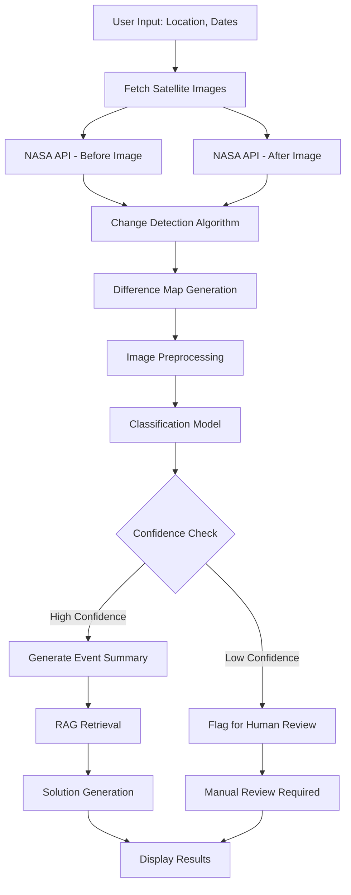

# 🛰️ Orbital Witness - Satellite Image Analysis System

[](https://www.python.org)
[](https://streamlit.io)
[](https://langchain.com)
[](https://api.nasa.gov)

An intelligent satellite imagery analysis system powered by AI agents, LangChain Expression Language (LCEL), and Retrieval-Augmented Generation (RAG) for detecting and providing solutions to environmental changes and disasters.

---

##  Overview

**Orbital Witness** is an advanced satellite imagery analysis platform that leverages cutting-edge AI technologies to detect environmental changes and provide actionable solutions. The system combines computer vision, natural language processing, and a knowledge base to identify events like deforestation, floods, wildfires, urban development, and more.

### Key Capabilities

- **Automated Change Detection**: Compares satellite images from different time periods
- **AI-Powered Classification**: Identifies the type of environmental change or disaster
- **Intelligent Solutions**: Provides context-aware short-term and long-term action plans
- **Interactive Interface**: User-friendly Streamlit dashboard for easy interaction

---

##  Features

###  Core Features

- **NASA API Integration**: Fetches real Landsat 8 satellite imagery
- **Computer Vision Processing**: Advanced image differencing and change detection
- **LCEL Agent Pipeline**: Modular, composable AI agent workflow
- **RAG-Based Solutions**: Knowledge base retrieval for contextual recommendations
- **Multi-Event Classification**: Detects 7+ different event types
- **Confidence Scoring**: Provides uncertainty metrics for human-in-the-loop review

###  Supported Event Types

| Event Type | Description |
|------------|-------------|
|  Deforestation | Illegal logging, forest clearing |
|  Flood | Natural flooding, storm surges |
|  Wildfire | Forest fires, grassland fires |
|  Urban Development | New construction, infrastructure expansion |
|  Volcanic Eruption | Volcanic activity and ash clouds |
|  Bombardment | Conflict-related structural damage |
|  Normal | No significant changes detected |

---

##  System Architecture

```
┌─────────────────────────────────────────────────────────────────┐
│                      GeoGuardian AI System                      │
└─────────────────────────────────────────────────────────────────┘
                              │
                              ▼
        ┌─────────────────────────────────────────┐
        │      Streamlit Web Interface            │
        │  (User Input: Location, Dates)          │
        └─────────────────────────────────────────┘
                              │
                              ▼
        ┌─────────────────────────────────────────┐
        │       Satellite Agent (LCEL Chain)      │
        └─────────────────────────────────────────┘
                              │
                 ┌────────────┼────────────┐
                 ▼            ▼            ▼
        ┌─────────────┐ ┌──────────┐ ┌─────────────┐
        │  NASA API   │ │  Change  │ │ RAG System  │
        │  (Imagery)  │ │ Detection│ │ (Solutions) │
        └─────────────┘ └──────────┘ └─────────────┘
                 │            │            │
                 └────────────┼────────────┘
                              ▼
        ┌─────────────────────────────────────────┐
        │    Classification & Analysis Result     │
        │  (Event Type, Confidence, Solutions)    │
        └─────────────────────────────────────────┘
```

---

## 🔧 Technology Stack

### Core Technologies

| Technology | Purpose | Version |
|------------|---------|---------|
| **Python** | Primary Language | 3.8+ |
| **Streamlit** | Web Interface | Latest |
| **LangChain** | Agent Framework | Latest |
| **LangChain-Groq** | LLM Integration | Latest |
| **FAISS** | Vector Database | CPU version |
| **OpenCV** | Image Processing | Latest |
| **NumPy** | Numerical Computing | Latest |

### AI & ML Components

- **HuggingFace Embeddings**: `sentence-transformers/all-MiniLM-L6-v2`
- **LLM Model**: Groq's `llama3-8b-8192`
- **Vector Store**: FAISS (Facebook AI Similarity Search)

### APIs

- **NASA Earth Imagery API**: Landsat 8 satellite data

---

##  Configuration

### Environment Variables

| Variable | Required | Description |
|----------|----------|-------------|
| `NASA_API_KEY` |  Yes | NASA API key for satellite imagery |
| `GROQ_API_KEY` |  Yes | Groq API key for LLM access |

### Knowledge Base

The system uses a knowledge base stored in `knowledge_base/disaster_solutions.txt`. You can customize this file to add more event types and solutions.

**Format:**
```
Event: [Event Name]
Short-Term Solutions: [Immediate actions]
Long-Term Solutions: [Strategic planning]
```

---

##  Usage

### Running the Application

```bash
python run.py
```

The application will start on `http://localhost:8501`

### Using the Interface

1. **Enter Location**: Provide latitude and longitude (e.g., `40.7128, -74.0060`)
2. **Select Dates**: Choose "Before" and "After" dates for comparison
3. **Analyze**: Click "Analyze Changes" button
4. **Review Results**: View detected changes, classification, and recommended solutions

### Command Line Options

```bash
# Run on custom port
streamlit run Interface/main.py --server.port 8080

# Run in headless mode
streamlit run Interface/main.py --server.headless true
```

---

##  Project Structure

```
ORBITAL_WITNESS/
│
├── app/                          # Core application logic
│   ├── __init__.py
│   ├── agent.py                  # Main LCEL agent pipeline
│   ├── classifier.py             # Image classification logic
│   ├── image_utils.py            # Image processing utilities
│   ├── nasa_api.py               # NASA API integration
│   └── prompts.py                # LangChain prompt templates
│
├── Interface/                    # User interface
│   ├── __init__.py
│   ├── main.py                   # Streamlit application
│   └── visualizer.py             # Result visualization
│
├── knowledge_base/               # RAG knowledge base
│   └── disaster_solutions.txt   # Solution templates
│
├── .env                          # Environment variables (not in repo)
├── .gitignore                    # Git ignore rules
├── requirements.txt              # Python dependencies
├── run.py                        # Application entry point
└── README.md                     # This file
```

---

##  Workflow Diagram

### Complete Agent Pipeline



### LCEL Chain Structure

```
┌─────────────────────────────────────────────────────────────┐
│                    Satellite Agent Chain                    │
├─────────────────────────────────────────────────────────────┤
│                                                             │
│  1. Data Fetch Stage                                        │
│     ├─ fetch_imagery(before_date)                          │
│     ├─ fetch_imagery(after_date)                           │
│     └─ detect_changes(before, after) → diff_map            │
│                                                             │
│  2. Classification Stage (LCEL)                             │
│     ├─ preprocess_image(diff_map)                          │
│     ├─ classify_image() → {label, confidence}              │
│     └─ generate_summary() → event_summary                  │
│                                                             │
│  3. Solution Generation Stage (RAG)                         │
│     ├─ retrieve_context(event_class)                       │
│     ├─ rag_chain.invoke()                                  │
│     └─ generate_solutions() → {short_term, long_term}      │
│                                                             │
└─────────────────────────────────────────────────────────────┘
```

---

##  Components Deep Dive

### 1. NASA API Module (`nasa_api.py`)

Handles satellite imagery fetching from NASA's Landsat 8 API.

**Key Functions:**
- `fetch_imagery(location, date)`: Retrieves satellite image for specific coordinates and date

**Features:**
- Error handling for missing images
- Automatic image decoding
- Configurable image dimensions

### 2. Image Processing (`image_utils.py`)

Computer vision operations for change detection.

**Key Functions:**
- `detect_changes(before, after)`: Generates difference map using OpenCV
- `preprocess_image(image)`: Prepares images for classification

**Algorithm:**
```python
1. Calculate absolute difference: diff = |before - after|
2. Convert to grayscale
3. Apply threshold (30 intensity units)
4. Resize to standard dimensions (256×256 or 224×224)
```

### 3. Classification System (`classifier.py`)

Image classification module (currently uses mock data for demonstration).

**Output Format:**
```python
{
    "label": "wildfire",  # Event type
    "confidence": 0.87    # Confidence score (0-1)
}
```

### 4. LCEL Agent (`agent.py`)

The heart of the system - implements LangChain Expression Language pipeline.

**Pipeline Stages:**

1. **Data Fetch**
   ```python
   RunnableLambda(initial_data_fetch)
   ```

2. **Classification Chain**
   ```python
   image_preprocessor | classifier_chain | summary_chain
   ```

3. **RAG Solution Chain**
   ```python
   retriever | SOLUTION_PROMPT | llm | StrOutputParser()
   ```

### 5. RAG System

**Components:**
- **Document Loader**: Loads disaster solutions from text file
- **Text Splitter**: Chunks knowledge base (500 chars, 50 overlap)
- **Embeddings**: HuggingFace sentence transformers
- **Vector Store**: FAISS for similarity search
- **LLM**: Groq's Llama 3 8B model

### 6. Prompt Engineering (`prompts.py`)

**Summary Prompt:**
```python
"Provide a brief, one-sentence summary for: {label}"
```

**Solution Prompt:**
```python
Based on:
- Detected Event: {event_class}
- Summary: {summary}
- Context: {context}

Provide:
1. Short-Term Solution
2. Long-Term Solution
```

---

##  Example Use Cases

### Use Case 1: Wildfire Detection

**Input:**
- Location: `34.0522, -118.2437` (Los Angeles)
- Before: `2024-06-01`
- After: `2024-06-15`

**Output:**
```
Event: Wildfire
Confidence: 0.91

Summary: A significant wildfire has been detected in the Los Angeles area,
showing rapid spread patterns consistent with dry season conditions.

Short-Term Solutions:
- Deploy aerial firefighting tankers
- Establish immediate evacuation zones
- Set up emergency shelters

Long-Term Solutions:
- Implement controlled burns
- Create defensible space
- Upgrade early warning systems
```

### Use Case 2: Deforestation Monitoring

**Input:**
- Location: `-3.4653, -62.2159` (Amazon Rainforest)
- Before: `2024-01-01`
- After: `2024-12-01`

**Output:**
```
Event: Deforestation
Confidence: 0.88

Summary: Large-scale forest clearing detected, indicating potential
illegal logging activity in protected rainforest area.

Short-Term Solutions:
- Dispatch patrols to halt illegal logging
- Use drone surveillance
- Seize equipment used for illegal clearing

Long-Term Solutions:
- Launch reforestation program
- Provide economic incentives for sustainable land use
- Strengthen legal protections
```

---

##  User Interface

### Main Dashboard

```
┌────────────────────────────────────────────────────────────┐
│  Orbital Witness: Satellite Image Analyzer                  │
├────────────────────────────────────────────────────────────┤
│                                                            │
│  ┌──────────────┐    ┌─────────────────────────────┐     │
│  │   Sidebar    │    │   Main Content Area         │     │
│  ├──────────────┤    ├─────────────────────────────┤     │
│  │ Location     │    │  Before Image               │     │
│  │ Before Date  │    │  After Image                │     │
│  │ After Date   │    │  Difference Map             │     │
│  │              │    │                             │     │
│  │ [Analyze]    │    │  Classification Results     │     │
│  │              │    │  - Event Type               │     │
│  │              │    │  - Confidence Score         │     │
│  │              │    │  - Summary                  │     │
│  │              │    │                             │     │
│  │              │    │  Recommended Solutions      │     │
│  │              │    │  - Short-term actions       │     │
│  │              │    │  - Long-term strategies     │     │
│  └──────────────┘    └─────────────────────────────┘     │
└────────────────────────────────────────────────────────────┘
```
---

##  Performance Metrics

### System Performance

| Metric | Value |
|--------|-------|
| Average Response Time | ~15-30 seconds |
| Image Processing Speed | ~2-3 seconds |
| Classification Time | ~1 second |
| RAG Retrieval Time | ~5-10 seconds |
| LLM Generation Time | ~10-15 seconds |

### Accuracy Metrics (Mock Classifier)

> **Note**: Current classifier uses mock data. Replace with trained model for production use.

---

##  Real-World Applications

### Government & Emergency Services
- Rapid disaster response planning
- Illegal activity monitoring
- Urban planning verification

### Environmental Organizations
- Deforestation tracking
- Conservation efforts
- Climate change impact assessment

### Insurance Companies
- Risk assessment
- Claim verification
- Policy pricing optimization

### Research Institutions
- Climate research
- Land use studies
- Environmental impact studies

---

<div align="center">

**Built by Rohit Ranjan Kumar**


</div>
